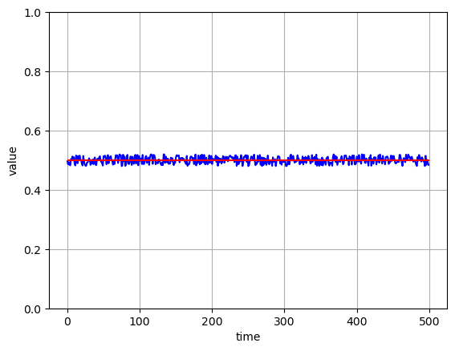
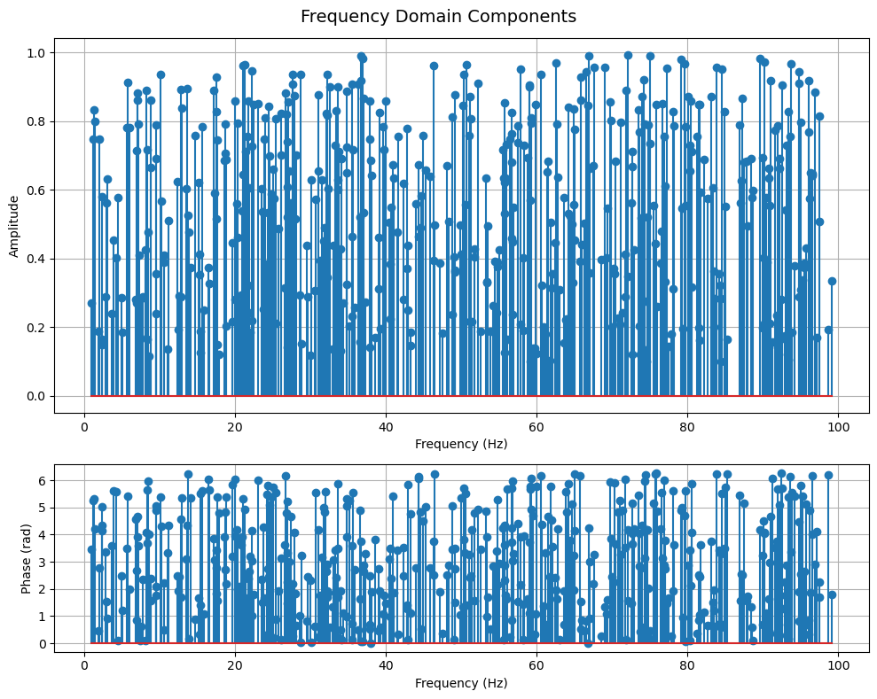
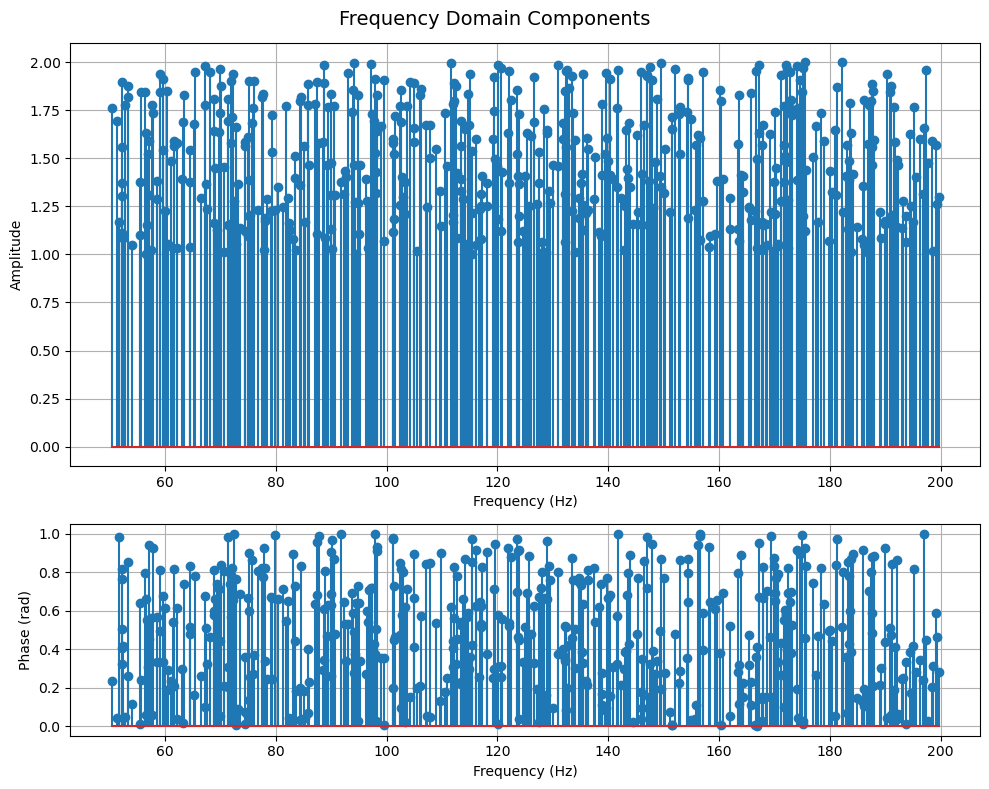
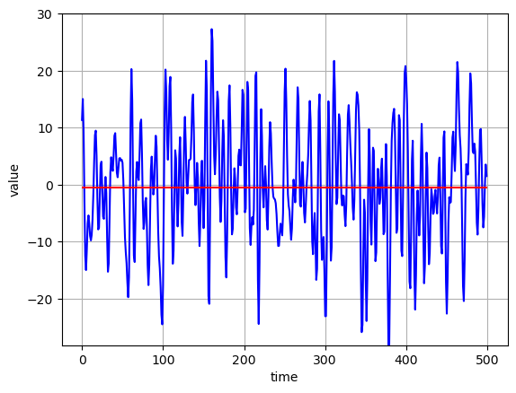

# Data Generation Tutorial

This tutorial will walk you through:

- importing the DataGen library
- Generating random data
- Generating frequency domain data
- Generating time domain signal data

## Setup and import packages

Import DataGen and other packages that are used in this tutorial

```python
import sys
import os

# Add the repo root to sys.path
repo_root = os.path.abspath(os.path.join("..", "src"))
if repo_root not in sys.path:
    sys.path.insert(0, repo_root)

from fault_injector.generate_data import DataGen
import numpy as np
import matplotlib.pyplot as plt
```

## Random Data

The steps to generate an array of random values is simple:

- set parameters: rand_min, rand_max, and size
- create class instance
- generate the values

```python
rand_max = 0.52
rand_min = 0.48
size = 500

# create class instance
gen_obj = DataGen(rand_max, rand_min, size)

# generate synthetic data
gen_obj.random_gen()
original_values = np.array(gen_obj.values)
gen_obj.plot_values()
```



## Generate Frequency Domain Data

Frequency Domain Data includes: Frequency, Amplitude, and Phase Data.

### Default Params

To generate frequency domain data with the default parameters, set `amp_params`, `freq_params`, and `phase_params` to `None`.

`gen_obj.plot_frequencies` can be used to visualize the generated data.

```python
rand_max = None
rand_min = None
size = 500

gen_obj = DataGen(rand_max, rand_min, size)
freq_dict = gen_obj.frequency_gen(amp_params = None,
                                  freq_params = None,
                                  phase_params = None)

# plot frequency data
gen_obj.plot_frequencies(params = freq_dict, title = "Frequency Domain Components", show_phases = True)
```



### Custom Params

The data can also be generated with custom parameters. This can be done by setting set `amp_params`, `freq_params`, and/or `phase_params` to a dictionary containing the `min` and `max` keys set to numeric values.

```python
rand_max = None
rand_min = None
size = 500

gen_obj = DataGen(rand_max, rand_min, size)

# custom parameters
amp_params = dict(min=1, max=2)
freq_params = dict(min=50, max=200)
phase_params = dict(min=0, max=1)
freq_dict = gen_obj.frequency_gen(amp_params = amp_params,
                                  freq_params = freq_params,
                                  phase_params = phase_params)

# plot frequency data
gen_obj.plot_frequencies(params = freq_dict, title = "Frequency Domain Components", show_phases = True)
```



## Generate a signal

To generate a time domain signal based on frequency domain data, use the `gen_obj.signal_gen` method. To plot the signal, use the `gen_obj.plot_signal` method.

```python
gen_obj.signal_gen(params=freq_dict)
gen_obj.plot_signal()
```


