# DataFrame Injector Demo

This tutorial will walk you through:

- importing the DataGen library
- Generating random data
- Generating frequency domain data
- Generating time domain signal data

## Setup and import packages

Import DataFrameInjector and other packages that are used in this tutorial

```python
import sys
import os
import pandas as pd
import numpy as np
import matplotlib.pyplot as plt

# Add the repo root to sys.path
repo_root = os.path.abspath(os.path.join("..", "src"))
if repo_root not in sys.path:
    sys.path.insert(0, repo_root)

from fault_injector.generate_data import DataGen
from fault_injector.injector import Injector
from fault_injector.df_injector import DataFrameInjector
from fault_injector.visualizer import FaultVisualizer
from fault_injector.fault_lib import *
```

## Starting Data

Create original data frame

```python
rand_max = 0.52
rand_min = 0.48
size = 500

df = pd.DataFrame()
for i in ['a','b','c','d','e']:
    col_name = f'col_{i}'
    print(f'Column name: {col_name}')

    # create class object
    gen_obj = DataGen(rand_max, rand_min, size)

    # generate synthetic data
    gen_obj.random_gen()
    df[col_name] = np.array(gen_obj.values)
    gen_obj.plot_values()
```

Column name: col_a


Column name: col_b

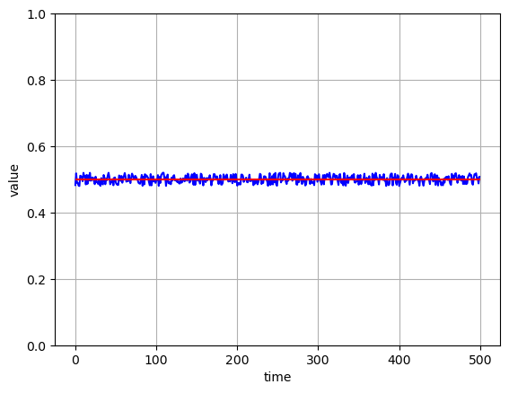

Column name: col_c

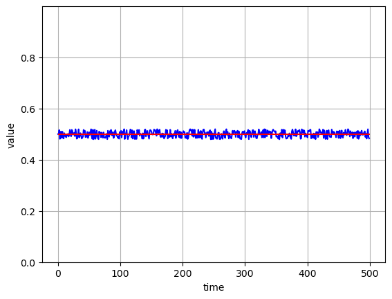

Column name: col_d


Column name: col_e

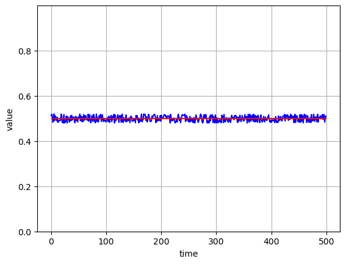

## Define Faults

Create two fault instances:

- drift_fault_obj: instance of the DriftFault with a drift rate of 0.0001
- stuck_fault_obj: instance of the StuckValueFault with a stuck value of 0.51

```python
fault_params = {"drift_rate": 0.0001}
drift_fault_obj = DriftFault(params=fault_params)

fault_params = {"stuck_val": 0.51}
stuck_fault_obj = StuckValueFault(params=fault_params)
```

## Define Injectors

Create 3 injector instances:

- injector_object_a: injection index range is 100 to 400 and uses the drift fault
- injector_object_b: injection index range is 100 to 400 and uses the stuck value fault
- injector_object_c: injection index range is 200 to 300 and uses the drift fault

Note: `col_d` gets the same injector as `col_c`

```python
# injector_a -> range: 100 to 400, drift fault
injector_params = {"start":100,
                   "stop": 400}
injector_object_a = Injector(fault=drift_fault_obj,
                           params=injector_params)

# injector_b -> range: 100 to 400, stuck value fault
injector_object_b = Injector(fault=stuck_fault_obj,
                           params=injector_params)

# injector_c -> range: 200 to 300, drift fault
injector_params = {"start":200,
                   "stop": 300}
injector_object_c = Injector(fault=drift_fault_obj,
                           params=injector_params)

injector_dict = {
                    "col_a": injector_object_a,
                    "col_b": injector_object_b,
                    "col_c": injector_object_c,
                    "col_d": injector_object_c,
                }

df_injector_object = DataFrameInjector(injector_dict=injector_dict)
```

Col_A

- Fault Type: drift
- Fault Range: 100:400
- Injector object: a

Col_B

- Fault Type: stuck value
- Fault Range: 100:400
- Injector object: b

Col_C

- Fault Type: drift
- Fault Range: 200:300
- Injector object: c

Col_D

- Fault Type: drift
- Fault Range: 200:300
- Injector object: c

Col_E

- Fault Type: None
- Fault Range: None
- Injector object: None

## Inject Fault

Inject the values and output the new values

Note: `col_e` does not get a fault injected into it

```python
new_values = df_injector_object.inject_faults(df=df)
```

## Compare Original to New Values

### Plot Fault Deltas

```python
# initiate the visualizer
vis = FaultVisualizer()

vis.plot_fault_delta_df(df, new_values, title='Fault Delta')
```

Column name: col_a

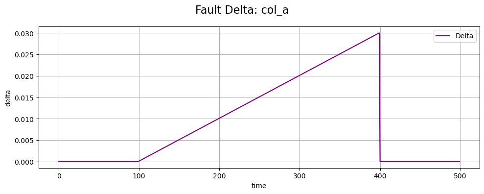

Column name: col_b

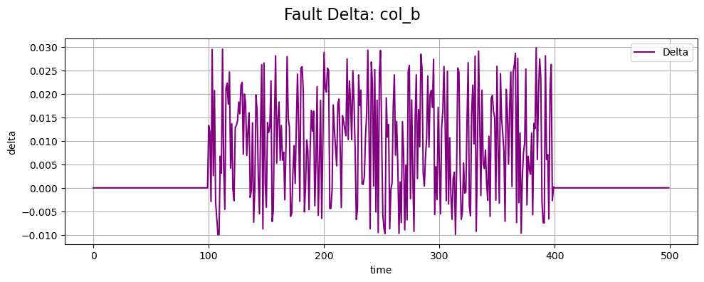

Column name: col_c


Column name: col_d

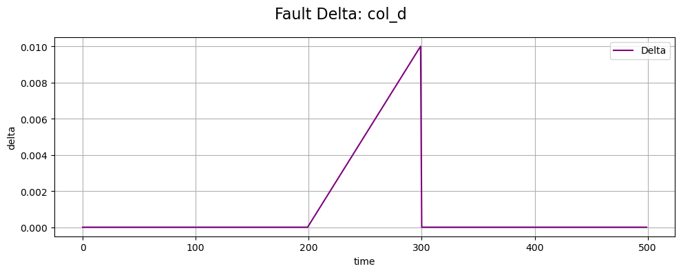

Column name: col_e

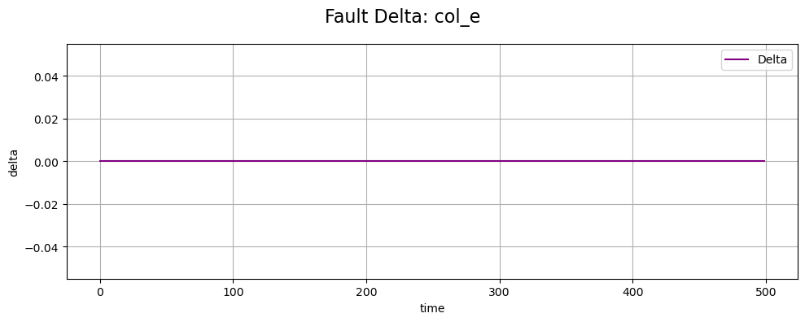

### Plot Comparison

```python
vis.plot_comparison_df(df, new_values, title='Comparison')
```

Column name: col_a

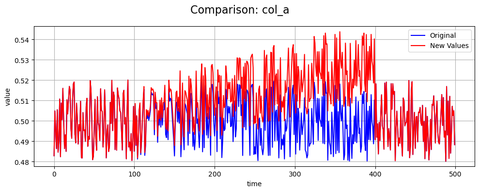

Column name: col_b

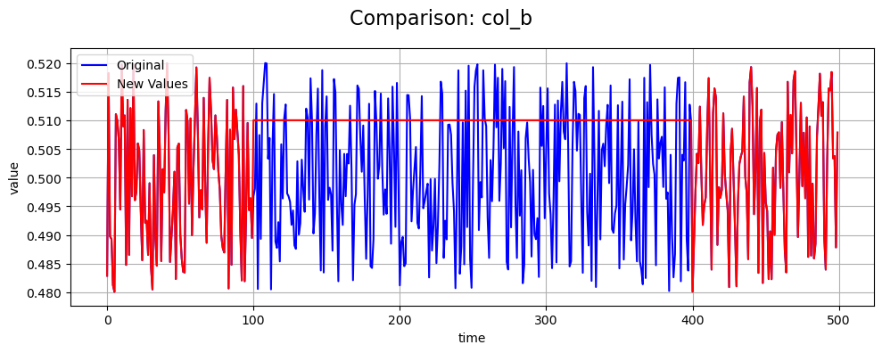

Column name: col_c

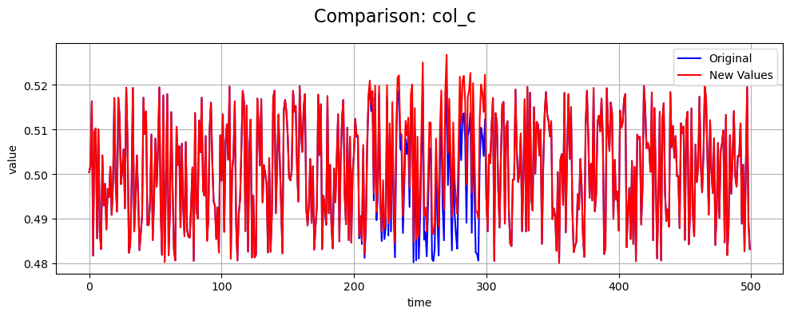

Column name: col_d

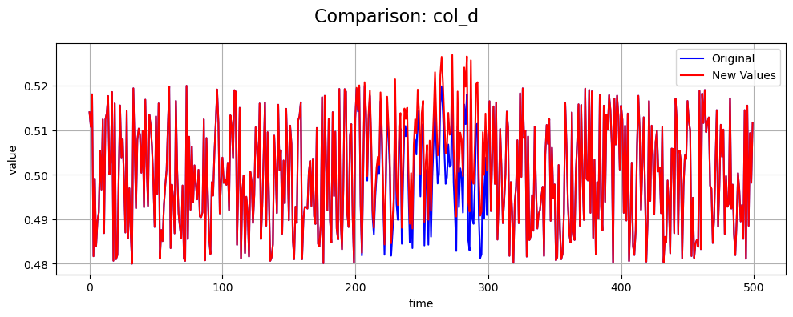

Column name: col_e

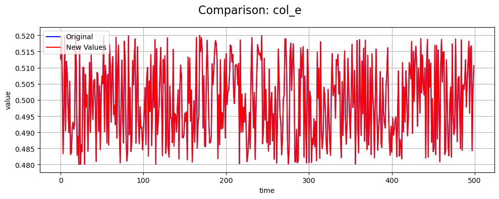
