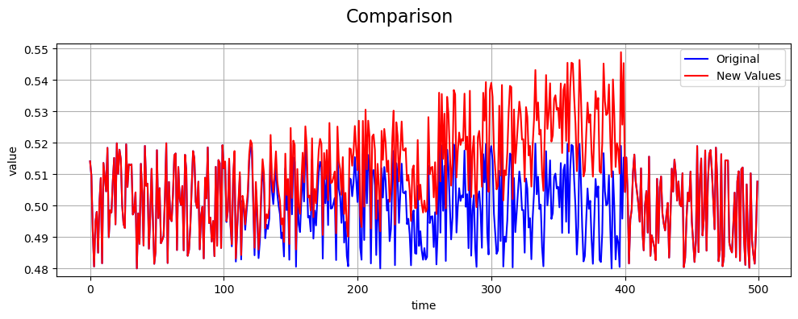

Drift Fault
===========

Define Fault
------------

A **sensor drift fault** models a gradual, systematic deviation of sensor
readings from their true values over time. Unlike abrupt faults (e.g.,
spikes or dropouts), drift accumulates slowly and can be difficult to
detect without trend analysis.

The **drift rate** corresponds to the slope of the fault-induced offset.
Larger drift rates cause the sensor readings to deviate more rapidly
from the true value. A drift rate of zero corresponds to no change from
the true signal.

Sensors can naturally drift over time due to aging, temperature
effects, calibration loss, or environmental exposure.

Math Behind Fault
-----------------

Assume a univariate time series of true sensor values:

- **True signal:** :math:`x_i`, for index :math:`i = 0, 1, ..., N-1`
- **Fault start index:** :math:`s`
- **Fault end index:** :math:`e`
- **Drift rate:** :math:`r`

Linear Drift Model
------------------

The observed (faulty) signal :math:`y_i` is defined as:

.. math::

   y_i =
   \begin{cases}
   x_i, & i < s \\
   x_i + (i - s) \cdot r, & s \le i < e \\
   x_i, & i \ge e
   \end{cases}

Impact on Statistical Properties
--------------------------------

Let the original signal :math:`x_i` have:

- **Mean:** :math:`\mu_x`
- **Variance:** :math:`\sigma_x^2`

Assume drift is applied for indices :math:`i = s, \dots, s + n - 1`, where
:math:`n = e - s` is the fault duration.

Effect on the Mean
------------------

The drift offset at time :math:`i` is:

.. math::

   \delta_i = (i - s) \, r

The average drift over the fault window is:

.. math::

   \bar{\delta} = \frac{1}{n} \sum_{k=0}^{n-1} k \, r
                 = r \frac{n-1}{2}

The mean of the faulty signal becomes:

.. math::

   \mu_y = \mu_x + r \frac{n-1}{2}

Effect on the Variance
----------------------

The variance of the faulty signal is:

.. math::

   \sigma_y^2 = \mathrm{Var}(x_i + \delta_i)
              = \sigma_x^2 + \mathrm{Var}(\delta_i) + 2 \, \mathrm{Cov}(x_i, \delta_i)

Assuming the true signal :math:`x_i` is independent of the drift term:

.. math::

   \mathrm{Cov}(x_i, \delta_i) \approx 0

The variance of the linear drift term is:

.. math::

   \mathrm{Var}(\delta_i) = r^2 \frac{n^2 - 1}{12}

Thus, the approximate variance of the faulty signal is:

.. math::

   \sigma_y^2 \approx \sigma_x^2 + r^2 \frac{n^2 - 1}{12}

Key takeaway
------------

Sensor drift affects both the mean and the variance, shifting the average
value while also increasing variability over time.

Example
-------

An example of a drift fault compared to the true values is shown below:

