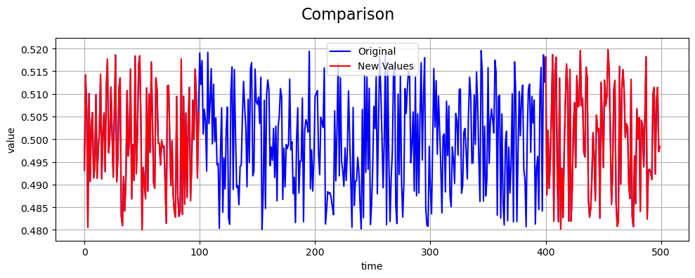

NaN Fault
=========

Define Fault
------------

A **NaN fault** models a sensor failure where readings are completely
missing for a continuous period of time. During the fault window, the
sensor does not report valid numeric values, and measurements are
represented as ``NaN`` (Not a Number).

NaN faults commonly occur due to communication dropouts, power failures,
buffer overflows, or temporary sensor disconnections. Unlike additive
faults (e.g., bias or drift), NaN faults do not alter the underlying
signal values—they remove them entirely from observation.

Math Behind Fault
-----------------

Assume a univariate time series of true sensor values:

- **True signal:** :math:`x_i`, for index :math:`i = 0, 1, ..., N-1`
- **Fault start index:** :math:`s`
- **Fault end index:** :math:`e`

Linear NaN Model
----------------

The observed (faulty) signal :math:`y_i` is defined as:

.. math::

   y_i =
   \begin{cases}
   \text{NaN}, & s \le i < e \\
   x_i, & \text{otherwise}
   \end{cases}

Key Takeaway
------------

NaN faults preserve the underlying statistical properties of the signal
but reduce the effective sample size and may cause failures in
algorithms that do not explicitly handle missing data.

Example
-------

An example of a NaN fault compared to the true values is shown below:

