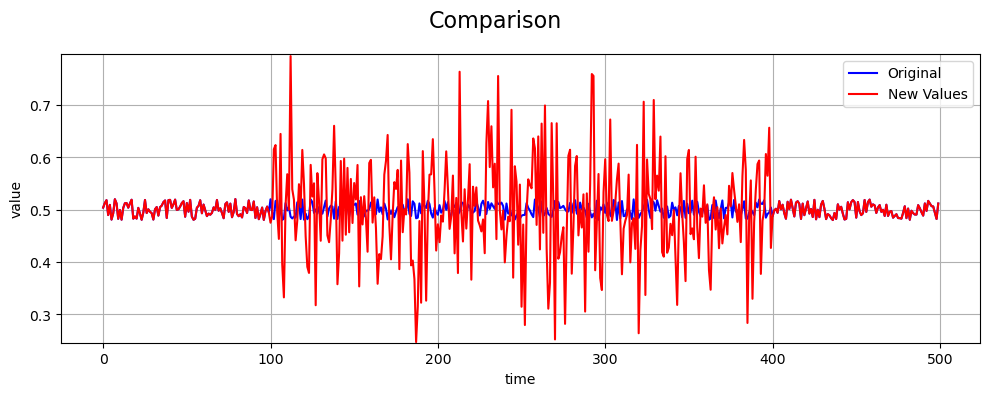

Normal Noise Fault
==================

Define Fault
------------

A **normal noise fault** models a sensor degradation where measurements
are corrupted by random noise drawn from a normal (Gaussian)
distribution. Unlike deterministic faults such as bias or drift, this
fault introduces stochastic fluctuations that reduce signal quality
without introducing a systematic offset.

Normal noise faults commonly arise from electromagnetic interference,
thermal noise, vibration, or partial hardware degradation.

Math Behind Fault
-----------------

Assume a univariate time series of true sensor values:

- **True signal:** :math:`x_i`, for index :math:`i = 0, 1, ..., N-1`
- **Fault start index:** :math:`s`
- **Fault end index:** :math:`e`

Linear Normal Noise Model
-------------------------

The observed (faulty) signal :math:`y_i` is defined as:

.. math::

   y_i =
   \begin{cases}
   x_i + \epsilon_i, & s \le i < e \\
   x_i, & \text{otherwise}
   \end{cases}

The noise term is independently sampled at each time step:

.. math::

   \epsilon_i \sim \mathcal{N}(\mu, \sigma^2)

By default, the noise parameters are:

.. math::

   \mu = 0, \qquad \sigma = \mathrm{std}(x_s, x_{s+1}, \ldots, x_{e-1})

Impact on Statistical Properties
--------------------------------

Let the original signal :math:`x_i` have mean and variance:

.. math::

   \mu_x = \mathbb{E}[x_i], \qquad \sigma_x^2 = \mathrm{Var}(x_i)

Assume noise is applied for indices :math:`i = s, \dots, s + n - 1`, where:

.. math::

   n = e - s

Effect on the Mean
------------------

The normal noise offset at time :math:`i` is:

.. math::

   \delta_i = \epsilon_i

Since the expected value of the noise is:

.. math::

   \mathbb{E}[\epsilon_i] = \mu

the expected mean of the faulty signal becomes:

.. math::

   \mu_y = \mu_x + \mu

With the default choice :math:`\mu = 0`, the mean remains unchanged:

.. math::

   \mu_y = \mu_x

Thus, normal noise does not introduce systematic bias when zero-mean
noise is used.

Effect on the Variance
----------------------

The variance of the faulty signal during the fault window is:

.. math::

   \sigma_y^2 = \mathrm{Var}(x_i + \epsilon_i)

Assuming the noise is independent of the true signal:

.. math::

   \sigma_y^2 = \sigma_x^2 + \sigma^2

This shows that **normal noise increases signal variance** while
preserving the underlying mean.

Key Takeaway
------------

Normal noise faults degrade signal quality by increasing randomness
rather than shifting the signal systematically.

Example
-------

An example of a normal noise fault compared to the true values is shown
below:

References
----------

- NumPy `normal` random generator:
  `https://numpy.org/doc/stable/reference/random/generated/numpy.random.normal.html <https://numpy.org/doc/stable/reference/random/generated/numpy.random.normal.html>`_
