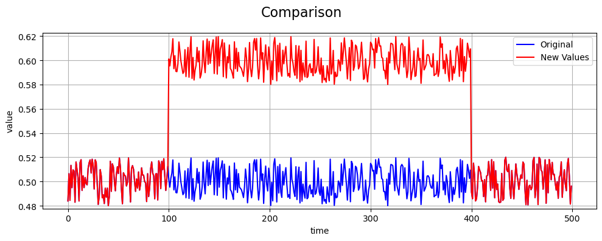

Offset Fault
============

Define Fault
------------

An **offset fault** models a sensor error in which a constant additive bias
is applied to the measured values over a specific time window. Unlike
drift, which accumulates gradually, an offset fault introduces an
instantaneous and fixed deviation from the true signal.

Let :math:`b` denote the offset magnitude applied during the fault
interval. The offset is defined relative to the signal scale as

.. math::

   b = r \cdot \frac{1}{e - s} \sum_{i=s}^{e-1} x_i

where :math:`r \in \mathbb{R}` is a dimensionless offset rate.

Offset faults commonly arise from calibration errors, sudden environmental
changes, or sensor misalignment.

Math Behind Fault
-----------------

Assume a univariate time series of true sensor values:

- **True signal:** :math:`x_i`, for index :math:`i = 0, 1, 2, ..., N-1`
- **Fault start index:** :math:`s`
- **Fault end index:** :math:`e`

Linear Offset Model
-------------------

The observed (faulty) signal :math:`y_i` is defined as:

.. math::

   y_i =
   \begin{cases}
   x_i + b, & s \le i < e \\
   x_i, & \text{otherwise}
   \end{cases}

This represents a constant additive bias during the fault window.

Key Takeaway
------------

Offset faults shift the average signal value while leaving the variance
unchanged.

Example
-------

An example of an offset fault compared to the true values is shown below:

