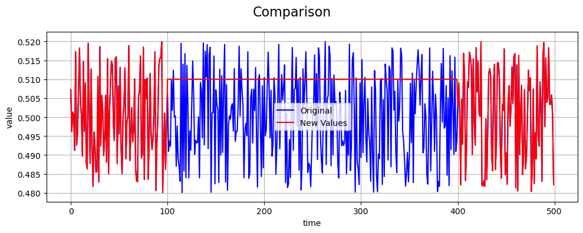

Stuck Value Fault
=================

Define Fault
------------

A **stuck value fault** models a sensor error in which readings become
constant for a period of time, effectively freezing the output at a
fixed value. Unlike offset faults, which introduce an additive bias,
stuck value faults replace the sensor signal entirely with a constant.

Stuck value faults can arise from hardware malfunctions, software errors,
or sensor saturation. Let :math:`c` denote the constant value to which
the sensor output is fixed during the fault interval.

The stuck value may be specified directly or generated relative to the
underlying signal. For example, :math:`c` may be defined as

.. math::

   c = \bar{x} \left( 1 + d \cdot u \right), \qquad
   u \sim \mathcal{U}(0.01, 0.1)

where

.. math::

   \bar{x} = \frac{1}{e - s} \sum_{i=s}^{e-1} x_i

and :math:`d \in \mathbb{R}` is a user-defined scaling factor.

Math Behind Fault
-----------------

Assume a univariate time series of true sensor values:

- **True signal:** :math:`x_i`, for index :math:`i = 0, 1, 2, \ldots, N-1`
- **Fault start index:** :math:`s`
- **Fault end index:** :math:`e`

Linear Stuck Value Model
------------------------

The observed (faulty) signal :math:`y_i` is defined as:

.. math::

   y_i =
   \begin{cases}
   c, & s \le i < e \\
   x_i, & \text{otherwise}
   \end{cases}

This represents the sensor output being fixed at :math:`c` during the
fault window.

Key Takeaway
------------

Stuck value faults freeze sensor outputs, shifting the mean toward the
stuck value and typically reducing variance.

Example
-------

An example of a stuck value fault compared to the true values is shown below:

