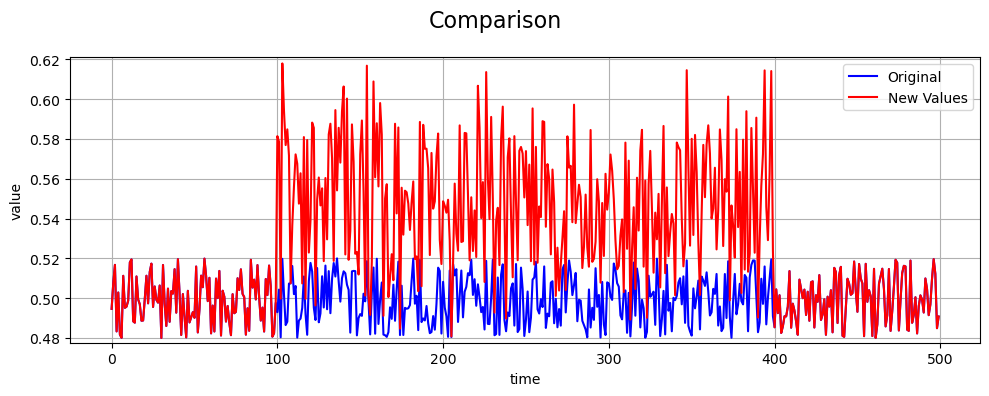

Uniform Noise Fault
===================

Define Fault
------------

A **uniform noise fault** models a sensor degradation where measurements
are corrupted by random noise drawn from a uniform distribution. Unlike
normal (Gaussian) noise, uniform noise introduces equally likely
fluctuations within a bounded range.

Uniform noise faults can occur due to quantization errors, sensor
resolution limits, or low-level interference.

By default, the noise range is chosen based on the signal's standard
deviation:

.. math::

   \epsilon_i \sim U(a, b), \quad
   a = -\text{std}(x_s, x_{s+1}, \ldots, x_{e-1}), \quad
   b = \text{std}(x_s, x_{s+1}, \ldots, x_{e-1})

Math Behind Fault
-----------------

Assume a univariate time series of true sensor values:

- **True signal:** :math:`x_i`, for index :math:`i = 0, 1, 2, \ldots, N-1`
- **Fault start index:** :math:`s`
- **Fault end index:** :math:`e`

Linear Uniform Noise Model
--------------------------

The observed (faulty) signal :math:`y_i` is defined as:

.. math::

   y_i =
   \begin{cases}
   x_i + \epsilon_i, & s \le i < e \\
   x_i, & \text{otherwise}
   \end{cases}

where :math:`\epsilon_i` is independently sampled from the uniform
distribution :math:`U(a, b)`.

Impact on Statistical Properties
--------------------------------

Let the original signal :math:`x_i` have mean and variance:

.. math::

   \mu_x = \mathbb{E}[x_i], \qquad \sigma_x^2 = \mathrm{Var}(x_i)

Assume noise is applied for indices :math:`i = s, s+1, \ldots, e-1`,
with fault duration:

.. math::

   n = e - s

Effect on the Mean
------------------

The uniform noise offset at time :math:`i` is:

.. math::

   \delta_i = \epsilon_i

Since the uniform distribution is symmetric by default, the expected
value of the noise is zero:

.. math::

   \mathbb{E}[\epsilon_i] = 0

Thus, the expected mean of the faulty signal is:

.. math::

   \mu_y = \mu_x

Uniform noise does not introduce systematic bias in the mean.

Effect on the Variance
----------------------

The variance of the noise term is:

.. math::

   \mathrm{Var}(\epsilon_i) = \frac{(b - a)^2}{12}

Assuming independence from the signal, the variance of the faulty signal
becomes:

.. math::

   \sigma_y^2 = \mathrm{Var}(x_i + \epsilon_i) = \sigma_x^2 + \frac{(b - a)^2}{12}

This shows that uniform noise increases the variability of the signal
without changing its average value.

Key Takeaway
------------

Uniform noise faults degrade signal quality by increasing randomness
while preserving the mean.

Example
-------

An example of a uniform noise fault compared to the true values is shown
below:

References
----------

- NumPy `uniform` random generator:
  `https://numpy.org/doc/stable/reference/random/generated/numpy.random.uniform.html <https://numpy.org/doc/stable/reference/random/generated/numpy.random.uniform.html>`_
